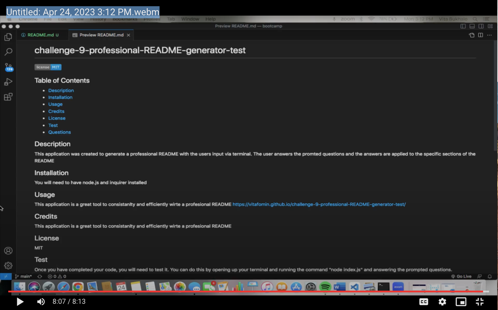

# challenge-9-professional-README-generator

## Description

This application was created to generate a professional README file. It is a command line application that accepts a users input. In the terminal the user is asked a series of questions. When the user enters the all the prompted questions regarding all the sections of the README, all the information is generated in the README file. The user also sees that the licesne badge is also generated according to the badge that they decided to include within their README file. The README file is generated and a README.md file is created once the user answers all the questions.
   

## Installation

Node.js and inquirer needs to be installed to allow this application to work

## Usage
This application is a neat tool for developers to efficiently write a README file to describe their project. This will allow individuals to save time when writing their README. This application is useful for developers.  

(https://drive.google.com/file/d/1ETUP0DHJy1P4O3a7TppnlczC8616kBwf/view)

## Credits

N/A

## License

Please refer to the LICENSE in the repo